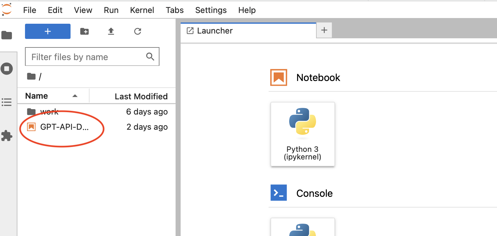

# GAISTEMP
 GAISTEMP Project

## Container Build and Launch Instructions

docker build -t gai-jupyter .

## Launch Jupyter

/bin/sh launch.sh 

- Copy the URL output from the launch script and paste into your web brower
- This should authenticate you into Jupyter
- In the upper left file browser on the Jupyter Notebook page, double-click on the GPT-API-Demo notebook file to start the notebook we will use for this exercise

## Container Details

This project builds a custom docker container image, based on the jupyter/scipy-notebook image on Docker Hub.

The build script adds two pip packages

- OpenAI: used for API access to OpenAI/ChatGPT
- python-dotenv: used by python and jupyter notebook to source environment variables from a file called .env

The build script also adds two files to the container runtime:

- .env: this text file contains the OpenAI API key as an environment variable
- GPT-API-Demo.ipynb: the Jupyter notebook used for the ChatGPT Demo
